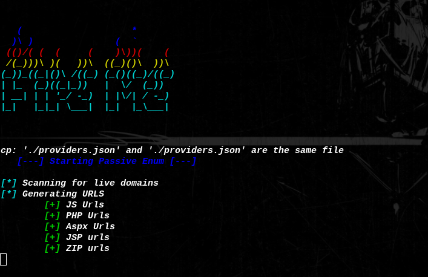

# FireMe
FireMe is a bugbounty automation script for recon purpose and data collection.


```	
	   (                    *        
	  )\ )               (  \`        
	 (()/( (  (     (    )\))(    (  
	 /(_)))\ )(   ))\  ((_)()\  ))\  
	(_))_((_|()\ /((_) (_()((_)/((_) 
	| |_  (_)((_|_))   |  \/  (_))   
	| __| | | '_/ -_)  | |\/| / -_)  
	|_|   |_|_| \___|  |_|  |_\___|  

```
## Usage:

```
Usage: ./fireme.sh [REQUIRED] [OPTIONS]

[REQUIRED]
	-z ZIP 	Zip file containing subdomains

[OPTIONS]
	-h 	Print this help message

```

## Description:
FireMe is a script for bugbounty recon phase data collection and information gathering for multiple targets and subdomains.
This tool help you getting started into bugbounty sinse i used it to do so.
> PS: This tools is not advised for targets that have move than 1K subdomains.
> It can take alot of time.

## Working proccess:
1. Scan for live domains.
2. Gets all the links and generate intresing ones.
3. Generates wordlists based on the result of the links.
4. Checks for probably vulnerable inputs.
5. Checks for subdomains takeover.
6. Uses massdns for dumping IPs.
7. nmap live domains.

## Recommendation:
Use this tool in combination with [projectdiscovery chaos](https://chaos.projectdiscovery.io/#/) tool to gain sometime and skip the subdomains enumeration which can take a really long time for big targets.

## Main Features:

| Tool | Author | Repository |
| :---         |     :---:      |          ---: |
| Httprobe | [Tomnomnom](https://github.com/tomnomnom) | [https://github.com/tomnomnom/httprobe](https://github.com/tomnomnom/httprobe) |
| waybackurls | [Tomnomnom](https://github.com/tomnomnom/)  | [https://github.com/tomnomnom/waybackurls](https://github.com/tomnomnom/waybackurls) |
| gau | [Corben Leo](https://github.com/lc/) | [https://github.com/lc/gau](https://github.com/lc/gau) |
| unfurl | [Tomnomnom](https://github.com/tomnomnom/) | [https://github.com/tomnomnom/unfurl](https://github.com/tomnomnom/unfurl) |
| gf | [Tomnomnom](https://github.com/tomnomnom/) | [https://github.com/tomnomnom/gf](https://github.com/tomnomnom/gf) |
| nmap | [Nmap](http://nmap.org/) |
| subjack | [Cody Zacharias](https://github.com/haccer/) | [https://github.com/haccer/subjack](https://github.com/haccer/subjack) |
| takeover.py | [m4ll0k](https://github.com/m4ll0k/) | [https://github.com/m4ll0k/takeover](https://github.com/m4ll0k/takeover) |
| SubOver | [Ice3man543](https://github.com/Ice3man543/) | [https://github.com/Ice3man543/SubOver](https://github.com/Ice3man543/SubOver) |
| massdns | [blechschmidt](https://github.com/blechschmidt/) | [https://github.com/blechschmidt/massdns](https://github.com/blechschmidt/massdns) |

## Installation & Requirements:
> Requires GO to be installed and specified in the PATH
```console
$ git clone https://github.com/soufian2017/FireMe
$ cd FireMe
$ chmod u+x install.sh
$ ./install.sh
```

## Preview:



## Thanks to:
- [Tomnomnom](https://github.com/tomnomnom) 
- [Corben Leo](https://github.com/lc/) 
- [Cody Zacharias](https://github.com/haccer/)
- [m4ll0k](https://github.com/m4ll0k/) 
- [Ice3man543](https://github.com/Ice3man543/) 
- [blechschmidt](https://github.com/blechschmidt/) 

## Todo:
```
**Active scanning:**

	- Gobuster
	- aquatone
	- get HTML
```
